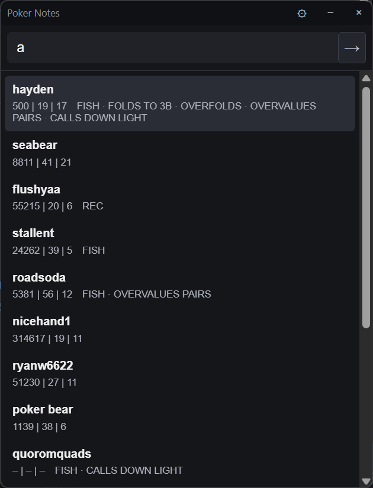
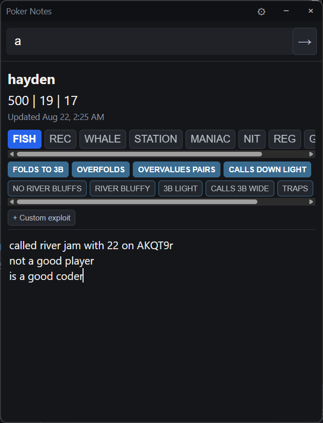
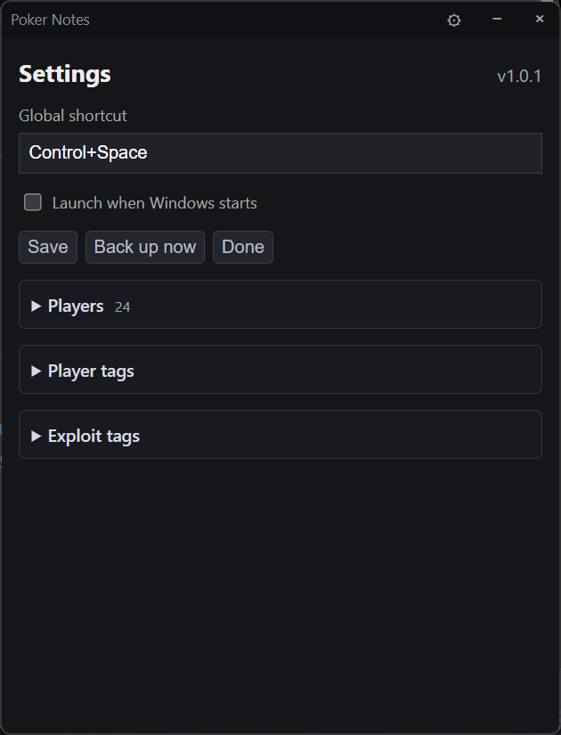

# Poker Player Notes

A fast, local Windows app for recording notes and reads on poker opponents.

All player data, notes, settings, and backups remain on your computer. The
application does not connect to the internet, use cloud services, send
telemetry, or communicate with poker clients.

## Features

- Global keyboard shortcut for quick access
- Player search, stats, tags, and autosaved notes
- Local SQLite storage with automatic backups
- No accounts, cloud services, telemetry, or poker-client integration

## Preview

| Search | Player notes | Settings |
| --- | --- | --- |
|  |  |  |

## Development

```powershell
npm install
npm run dev
```

Run checks with `npm run typecheck`, `npm test`, and `npm run build`.

## License

Official compiled releases may be downloaded and used freely. Source code is
available for inspection only; modification and redistribution are prohibited.
See [LICENSE](LICENSE).
